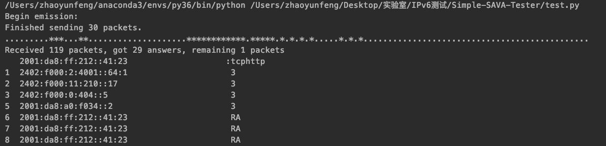

# Simple-SAVA-Tester

## 想法
 - 能不能在路径上用client对某个路由器模拟TCP三次握手，在即将要完成的时候把让server伪造client来发最后一个包，然后client用某种行为来验证与路由器的tcp连接已经被建立了
    - 要么是重新发送这个包，看那边会回复什么？
    - 要么是直接来close掉这个连接
 - 不用那么麻烦，ping包的reply包是真实的，所以直接用伪造源地址ping那台设备就可以看看这台设备有没有收到这个包了
 
## TODO
 - traceroute的时候有空缺的跳数似乎？
    - 